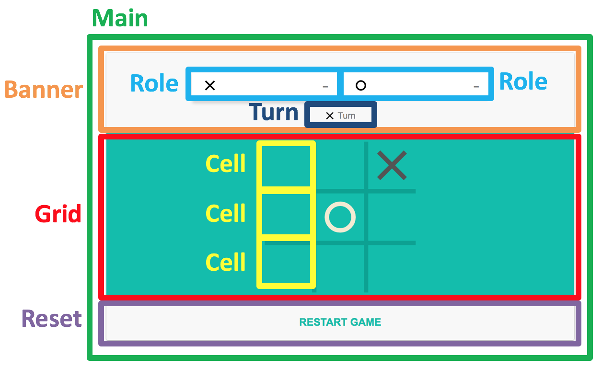

# HW3 - Tic-Tac-Toe
 
In this lab, we will build a tic-tac-toe game with component-based style. There are **9 todos** in the code blanked by TAs in the "src" folder. You need to follow the comments and fill in the correct codes to make the game work. 
Follow the structure as shown above. 

## Example
https://drive.google.com/file/d/1S5V6bOu2LsvHwTX7AXuuDBZMblYNjlBF/view?usp=sharing

## Grading
#### 1. Banner **(10%)**
* Reset the banner and the child components in it
#### 2. Grid **(30%)**
* Handle the cell clicked event (10%)
* Fire an event if the game is over (10%)
* Check if all cells are occupied (10%)
#### 3. Role **(10%)**
* Set the score
#### 4. Reset **(20%)**
* Build your own reset class
#### 5. Main **(30%)**
* Finish the constructor (10%)
* Handle the cell clicked event (10%)
* Handle the reset clicked event (10%)

You shoud <b>not</b> modify the existing code or add your own function or file, except "8. reset.js".

## Submission
The deadline of this assignment is `2021/04/08 23:59`. 
When you open merge request, the title should be : `{your ID} Submission`

## Important
To test the code, you should run `npm install` first, then run `npm run build` or `npm run watch` sequently.
